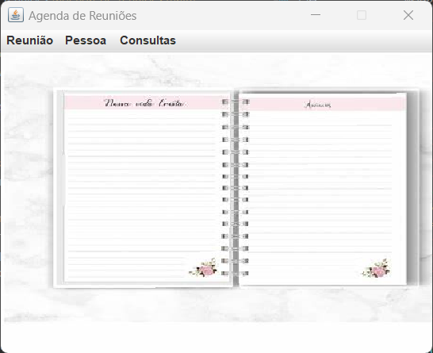

# Agenda de Reunião
Tema da disciplina de Persistência a Objetos, a Agenda de Reunião visa o gerenciamento de uma empresa no quesito reuniões.

## Objetivo
Praticar os conceitos de persistência transparente de objetos, através do
desenvolvimento de protótipo de um sistema de informação, usando Java e o bancos 
de dados, tanto para objetos (db4o), quanto para relacional (postgreSQL) ou documental (MongoDB).

## Funcionalidades
- Agendamento de reuniões
- Cadastro de pessoas na reunião
- Listagem de todas as pessoas da reunião específica
- Listagem de todas as reuniões da pessoa específica
- Consultar dados das reuniões

## Requisitos para funcionar

- Ver arquivo pom.xml, na raiz do projeto.

## Contribuidores
- Allan Amâncio - https://github.com/AllanSmithll;
- Márcio José - https://github.com/ImMarcio.

## Licença
Este projeto está licenciado sob a [Licença MIT](https://opensource.org/license/mit/).

## Preview

